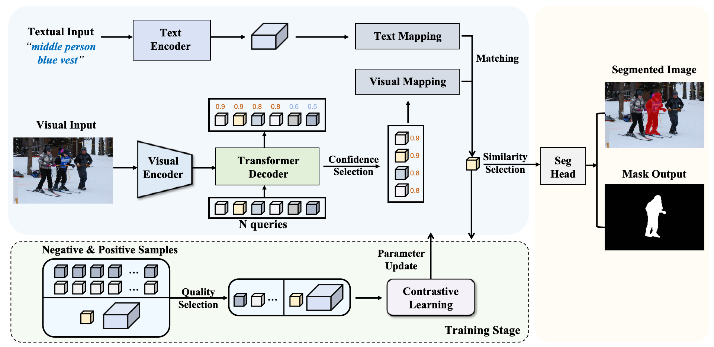

# QueryMatch

This is the official implementation of "QueryMatch: A Query-based Contrastive Learning Framework for Weakly Supervised Visual Grounding". In this paper, we propose a novel query-based one-stage framework for weakly supervised visual grounding, namely QueryMatch, Different from previous work, QueryMatch represents candidate objects with a set of query features, which inherently establish accurate one-to-one associations with visual objects. In this case, QueryMatch re-formulates weakly supervised visual grounding as a query-text matching problem, which can be optimized via the query-based contrastive learning. Based on QueryMatch we further propose an innovative strategy for effective weakly supervised learning, namely Active Query Selection (AQS). In particular, AQS aims to enhance the effectiveness of query-based contrastive learning by actively selecting high-quality query features.

<p align="center">
	
</p>

## Changes 
- **`2025/04`**: Optimized memory usage in the AQS implementation, improved some code, and released the trained QueryMatch weights.
- **`2024/07`**: Our paper was accepted for ACM MM 2024.
- **`2024/04`**: The repository was initially created.

## Installation
- Clone this repo
```bash
git clone https://github.com/TensorThinker/QueryMatch.git
cd QueryMatch
```

- Create a conda virtual environment and activate it
```bash
conda create -n querymatch python=3.8 -y
conda activate querymatch
```

- Install Pytorch following the [official installation instructions](https://pytorch.org/get-started/previous-versions)

```bash
# CUDA 11.7
pip install torch==2.0.1 torchvision==0.15.2 torchaudio==2.0.2
```

- Install detectron following the [official installation instructions](https://detectron2.readthedocs.io/en/latest/tutorials/install.html)
  
```bash
git clone https://github.com/facebookresearch/detectron2.git
python -m pip install -e detectron2
```

- Install apex following the [official installation guide](https://github.com/NVIDIA/apex)

```bash
pip install -v --disable-pip-version-check --no-build-isolation --no-cache-dir ./
```

- Compile the DCN layer:
  
```bash
cd utils_querymatch/DCN
./make.sh
```

```bash
cd mask2former
pip install -r requirements.txt
cd ./modeling/pixel_decoder/ops
sh make.sh
```

```bash
wget https://github.com/explosion/spacy-models/releases/download/en_vectors_web_lg-2.1.0/en_vectors_web_lg-2.1.0.tar.gz -O en_vectors_web_lg-2.1.0.tar.gz
pip install en_vectors_web_lg-2.1.0.tar.gz
pip install albumentations
pip install Pillow==9.5.0
pip install tensorboardX
```

## Data Preparation

- Download images and Generate annotations according to [SimREC](https://github.com/luogen1996/SimREC/blob/main/DATA_PRE_README.md).
- Download the pretrained weights of Mask2former from [OneDrive](https://1drv.ms/u/c/e3df1503c007b3c7/EZcn4gxHhcZKjWRgZl9MbgoBS_TS-_EqnCvV355cSp4laQ?e=XQsvtM).
- The project structure should look like the following:

```
| -- QueryMatch
     | -- data
        | -- anns
            | -- refcoco.json
            | -- refcoco+.json
            | -- refcocog.json
        | -- images
            | -- train2014
                | -- COCO_train2014_000000000072.jpg
                | -- ...
     | -- config_querymatch
     | -- configs
     | -- datasets
     | -- datasets_querymatch
     | -- DCNv2_latest
     | -- detectron2
     | -- mask2former
     | -- models_querymatch
     | -- ...
```
- NOTE: our Mask2former is trained on COCO’s training images, 
excluding those in RefCOCO, RefCOCO+, and RefCOCOg’s validation+testing. 

## QueryMatch

### Training
```
python train_querymatch.py --config ./config_querymatch/[DATASET_NAME].yaml --config-file ./configs/coco/instance-segmentation/swin/maskformer2_swin_base_384_bs16_50ep.yaml --eval-only MODEL.WEIGHTS [PATH_TO_MASK2FORMER_WEIGHT]

```

### Evaluation
```
python test_querymatch.py --config ./config_querymatch/[DATASET_NAME].yaml --eval-weights [PATH_TO_CHECKPOINT_FILE] --config-file ./configs/coco/instance-segmentation/swin/maskformer2_swin_base_384_bs16_50ep.yaml --eval-only MODEL.WEIGHTS [PATH_TO_MASK2FORMER_WEIGHT]

```

## Model Zoo

QueryMatch on three RES benchmark datasets
<table class="tg" style="undefined;table-layout: fixed">
<colgroup>
<col style="width: 140px">
<col style="width: 60px">
<col style="width: 60px">
<col style="width: 60px">
<col style="width: 60px">
<col style="width: 60px">
<col style="width: 60px">
<col style="width: 100px">
</colgroup>
<thead>
<tr>
<th class="tg-7btt"><span style="color:#000">Method</span></th>
<th class="tg-7btt" colspan="3"><span style="color:#000">RefCOCO</span></th>
<th class="tg-7btt" colspan="3"><span style="color:#000">RefCOCO+</span></th>
<th class="tg-7btt"><span style="color:#000">RefCOCOg</span></th>
</tr>
</thead>
<tbody>
<tr>
<td class="tg-c3ow"></td>
<td class="tg-c3ow"><span style="color:#000">val</span></td>
<td class="tg-c3ow"><span style="color:#000">testA</span></td>
<td class="tg-c3ow"><span style="color:#000">testB</span></td>
<td class="tg-c3ow"><span style="color:#000">val</span></td>
<td class="tg-c3ow"><span style="color:#000">testA</span></td>
<td class="tg-c3ow"><span style="color:#000">testB</span></td>
<td class="tg-c3ow"><span style="color:#000">val-g</span></td>
</tr>
<tr>
<td class="tg-0pky"><strong>QueryMatch</td>
<td class="tg-c3ow">59.10</td>
<td class="tg-c3ow">59.08</td>
<td class="tg-c3ow">58.82</td>
<td class="tg-c3ow">39.87</td>
<td class="tg-c3ow">41.44</td>
<td class="tg-c3ow">37.22</td>
<td class="tg-c3ow">43.06</td>
</tr>
<tr>
<td class="tg-0pky"></td>
<td colspan="3" class="tg-c3ow" style="text-align: center; ">
    <a href="https://1drv.ms/u/c/e3df1503c007b3c7/EWaxZJUNL2ZDs6hfaIgROLsBMjvU4O5gT1juNf3Dq9ys_A?e=FhUZVk">
        RefCOCO_QueryMatch
    </a>
</td>
<td colspan="3" class="tg-c3ow" style="text-align: center; ">
    <a href="https://1drv.ms/u/c/e3df1503c007b3c7/ETEv6MQJNO1LnYLkR9NtOMkBdFVOpc915q5_TwtyGQRb0A?e=DJ3Tri">
        RefCOCO+_QueryMatch
    </a>
</td>
<td class="tg-c3ow" style="text-align: center;">
    <a href="https://1drv.ms/u/c/e3df1503c007b3c7/EdMBLA3R-adGuPlvqrfEBlABokkemVQCrwvQod9GnTzMLg?e=HjS5hx">
        RefCOCOg_QueryMatch
    </a>
</td>
</tr>
</tbody>
</table>
QueryMatch on three REC benchmark datasets
<table class="tg" style="undefined;table-layout: fixed">
<colgroup>
<col style="width: 140px">
<col style="width: 60px">
<col style="width: 60px">
<col style="width: 60px">
<col style="width: 60px">
<col style="width: 60px">
<col style="width: 60px">
<col style="width: 100px">
</colgroup>
<thead>
<tr>
<th class="tg-7btt"><span style="color:#000">Method</span></th>
<th class="tg-7btt" colspan="3"><span style="color:#000">RefCOCO</span></th>
<th class="tg-7btt" colspan="3"><span style="color:#000">RefCOCO+</span></th>
<th class="tg-7btt"><span style="color:#000">RefCOCOg</span></th>
</tr>
</thead>
<tbody>
<tr>
<td class="tg-c3ow"></td>
<td class="tg-c3ow"><span style="color:#000">val</span></td>
<td class="tg-c3ow"><span style="color:#000">testA</span></td>
<td class="tg-c3ow"><span style="color:#000">testB</span></td>
<td class="tg-c3ow"><span style="color:#000">val</span></td>
<td class="tg-c3ow"><span style="color:#000">testA</span></td>
<td class="tg-c3ow"><span style="color:#000">testB</span></td>
<td class="tg-c3ow"><span style="color:#000">val-g</span></td>
</tr>
<tr>
<td class="tg-0pky"><strong>QueryMatch</td>
<td class="tg-c3ow">66.02</td>
<td class="tg-c3ow">66.00</td>
<td class="tg-c3ow">65.48</td>
<td class="tg-c3ow">44.76</td>
<td class="tg-c3ow">46.72</td>
<td class="tg-c3ow">41.50</td>
<td class="tg-c3ow">48.47</td>
</tr>
<tr>
<td class="tg-0pky"></td>
<td colspan="3" class="tg-c3ow" style="text-align: center; ">
    <a href="https://1drv.ms/u/c/e3df1503c007b3c7/EWaxZJUNL2ZDs6hfaIgROLsBMjvU4O5gT1juNf3Dq9ys_A?e=FhUZVk">
        RefCOCO_QueryMatch
    </a>
</td>
<td colspan="3" class="tg-c3ow" style="text-align: center; ">
    <a href="https://1drv.ms/u/c/e3df1503c007b3c7/ETEv6MQJNO1LnYLkR9NtOMkBdFVOpc915q5_TwtyGQRb0A?e=DJ3Tri">
        RefCOCO+_QueryMatch
    </a>
</td>
<td class="tg-c3ow" style="text-align: center;">
    <a href="https://1drv.ms/u/c/e3df1503c007b3c7/EdMBLA3R-adGuPlvqrfEBlABokkemVQCrwvQod9GnTzMLg?e=HjS5hx">
        RefCOCOg_QueryMatch
    </a>
</td>
</tr>
</tbody>
</table>

## Notes
### Experimental Environment for Ours
- GPU: RTX 4090(24GB)
- CPU: 32 vCPU Intel(R) Xeon(R) Platinum 8352V CPU @ 2.10GHz
- CUDA 11.7
- torch 2.0.1
### Compatibility Note
This project is compatible with multiple CUDA versions, including but not limited to CUDA 11.3. While the relative performance trends remain consistent across different hardware environments, please note that the specific numerical results may vary slightly.

## Citation

```BibTeX
@inproceedings{chen2024querymatch,
  title={QueryMatch: A Query-based Contrastive Learning Framework for Weakly Supervised Visual Grounding},
  author={Chen, Shengxin and Luo, Gen and Zhou, Yiyi and Sun, Xiaoshuai and Jiang, Guannan and Ji, Rongrong},
  booktitle={Proceedings of the 32nd ACM International Conference on Multimedia},
  pages={4177--4186},
  year={2024}
}
```
## Acknowledgement

Thanks a lot for the nicely organized code from the following repos
- [Mask2Former](https://github.com/facebookresearch/Mask2Former)
- [SimREC](https://github.com/luogen1996/SimREC)
